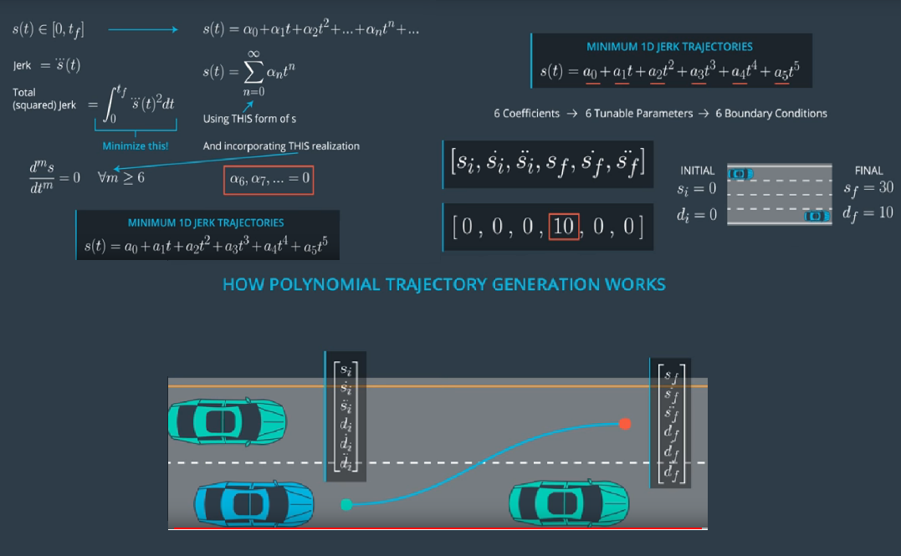

[//]: # (Image References)

[image1]: ./IMG_RESULTS/playfuldesertedblackrussianterrier-size-restricted.gif "Gif"
[image2]: ./IMG_RESULTS/Lanes.png "Lanes"
[image3]: ./IMG_RESULTS/LaneKeep2.png "Lane Keep"
[image4]: ./IMG_RESULTS/LanesChange.png "Lanes Change"
[image5]: ./IMG_RESULTS/BehaviorLayers.png "Behavior Layers"
[image6]: ./IMG_RESULTS/BehaviorPlanning.png "Behavior Planning"
[image7]: ./IMG_RESULTS/Lanes2.png "Lanes Change"

# CarND-Path-Planning-Project
### Self-Driving Car Engineer Nanodegree Program

<p align="center">
  
</p>

# Behavior Planning

The Behavior Planning goal is to safely navigate around a virtual highway with other traffic that is driving around speed limit. The car should try to go as close as possible to the speed limit, which means passing slower traffic when possible, even though other cars will try to change lanes too. The car should avoid hitting other cars at all cost as well as driving inside of the marked road lanes at all times, unless going from one lane to another. Also the car should not experience total acceleration over 10 m/s^2 and jerk that is greater than 10 m/s^3.

This layer is provided with the car's localization and sensor fusion data, there is also a sparse map list of waypoints around the highway. 

![Behavior Planning][image6]

Using this information, is the responsability of The Path Planning module come up with:
* predictions: will predict the trajectories of the surrounding detected objects
* behavior planner: will define a set of candidate high-level targets for the vehicle to follow (lane changes, slow down ...)
* trajectories generation: for every possible high level target, a precise path to follow will be computed
* trajectories cost ranking: for each trajectory, a cost will be derived (depending on feasibility, safety, legality, comfort, and efficiency) and the trajectory with the lowest cost will be chosen

![Behavior Layers][image5]

### *************************************************************************/
## Waypoint Data

Each waypoint has an (x,y) global map position, and a Frenet s value and Frenet d unit normal vector. 
The s value is the distance along the direction of the road. 
The d vector has a magnitude of 1 and points perpendicular to the road in the direction of the right-hand side of the road. 

Using Fernet coordinates (d,s) we can know the position of our car in the road.

![Car Position][image2]

if you want to be in the left lane at some waypoint just add the waypoint's (x,y) coordinates with the d vector multiplied by 2. Since the lane is 4 m wide, the middle of the left lane (the lane closest to the double-yellow dividing line) is 2 m from the waypoint. 
If you would like to be in the middle lane, add the waypoint's coordinates to the d vector multiplied by 6 = (2+4), since the center of the middle lane is 4 m from the center of the left lane, which is itself 2 m from the double-yellow dividing line and the waypoints.


### *************************************************************************/
## SENSOR FUSION


```Cpp
// Sensor Fusion Data is a list of all other cars on the same side 
//   of the road.
// The data format for each car is: [ id, x, y, vx, vy, s, d]
auto sensor_fusion = j[1]["sensor_fusion"];
```
We can estract the data from this array like:

```Cpp
/*The data format for each car is: [ id, x, y, vx, vy, s, d]
    id is a unique identifier for that car 
    x, y values are in global map coordinates
    vx, vy values are the velocity components (reference to the global map)
    s and d are the Frenet coordinates for that car.
*/
for(int i = 0; i < sensor_fusion.size(); i++)
{

  float check_other_car_d = sensor_fusion[i][6];
  double check_other_car_vx = sensor_fusion[i][3];
  double check_other_car_vy = sensor_fusion[i][4];
  //magnitud of velocity on x and y
  double check_other_car_speed = sqrt(check_other_car_vx * check_other_car_vx + check_other_car_vy * check_other_car_vy);
  double check_other_car_s = sensor_fusion[i][5];
  :
  :
}
```
And we can know if we have cars in front of us, 30 mts ahead. We can use this information to start breaking and to prepare to change lanes if the adjacent lines are available.

![alt text][image7]

```Cpp

/*Middle point of car's lane is 'lane' + 2 and 'lane' size is 4.*/
if(check_other_car_d < (2+4*lane+2) && check_other_car_d > (2+4*lane-2))
{
    /*car is in my lane*/            	

    check_other_car_s += ((double)previous_path_size * 0.02 * check_other_car_speed);
    //check s values greater than mine and s gap
    if((check_other_car_s > car_s) && ((check_other_car_s - car_s) < 30/*mts*/))
    {
      //Reduce velocity so we don't crash
        //flag to try to change lanes                  	
        too_close = true;                  	

    }
}
```

We are also checking all the time for cars on other. So we allways know if the left lane or the right lane are available at all time. 

We check for cars 10 mts ahead of us and 30 mts back to consider the next lane available or not in case we want to change our lane

![alt text][image4]

```Cpp
bool left_lane_is_empty = true;
bool right_lane_is_empty = true;

/*The d vector has a magnitude of 1 and points perpendicular to the road in the direction of the right-hand side of the road.
Each lane is 4 m wide and our car should only ever be in one of the 3 lanes on the right-hand side.
Lane 0: High speed - Lane 1: meddle - Lane 2: Low speed
*/ 
```
#### Check left lane allways
```Cpp
if((lane > 0) 
      /*is the other car in between of the next left lane left boundary*/
      && check_other_car_d > (/*left lane = */(lane - 1)* /*lane width = */ 4)
      /*...and the next left lane right boundary*/
      && check_other_car_d < (/*left lane = */(lane - 1)* /*lane width = */ 4) + 4)
{
  //check s position in between +10mts and -30mts of our car
  if((check_other_car_s < (car_s + 10/*mts*/)) && (check_other_car_s > (car_s - 30/*mts*/)))
  {
    //Another car is in this lane
    left_lane_is_empty = false;
  }

}
```
#### Check right lane allways
```Cpp
if((lane < 2) 
      /*is the other car in between of the next right lane left boundary*/
      && check_other_car_d > (/*right lane = */(lane + 1)* /*lane width = */ 4)
      /*...and the next right lane right boundary*/
      && check_other_car_d < (/*right lane = */(lane + 1)* /*lane width = */ 4) + 4)
{
  //check s position in between +10mts and -30mts of our car
  if((check_other_car_s < (car_s + 10/*mts*/)) && (check_other_car_s > (car_s - 30/*mts*/)))
  {
    //Another car is in this lane
    right_lane_is_empty = false;
  }

}

```

To summerize, thanks to sensor fusion we know our location all the time, and the position of other cars in front and at our sides. This allows us to break, change lanes or just wait until a lane gets available.

![alt text][image3]

### *************************************************************************/
## Trajectories generation

### Interpolating Points

To generate trajectories by using (x, y) coordinates we take Frenet (s and d) coordinates only to define the final target eg a s of 30 meters away with a d corresponding to the target lane. This target point is converted into (x, y) coordinates and a trajectory going from the start point up to the end point (in cartesian coordinates) is computed by using splines. 

We need to estimate the location of points between the known waypoints, so we will need to "interpolate" the position of those points. 
We could use to functions for fitting polynomials to waypoints. There are also other methods we can use. For example, Bezier curve fitting with control points, or spline fitting, which guarantees that the generated function passes through every point.

Using splines ensures that continuity is preserved for the generated trajectory and its 1st and 2nd derivatives: so we guarantee continuity in terms of trajectory, speed and acceleration including end points and previous trajectory. The advantage of this method is that it works pretty well even if the (s, d) estimates are not that accurate as it mainly works in (x, y) coordinates and most of the maths is handled via the C++ spline library which is very simple to use. In terms of drawbacks, it does not guarantee Minimum Jerk which is related to maximum comfort for the user.

Here is a great and easy to setup and use [spline tool for C++](https://kluge.in-chemnitz.de/opensource/spline/), contained in just a single header file.
Once we have a polynomial function, we can use it to interpolate the location of a new point.

### Jerk Minimizing Trajectory

The jerk corresponds to variations in acceleration. The idea is to minimize the sum of these 3rd derivatives from t_start to t_end. [Jerk Minimizing Trajectory](http://courses.shadmehrlab.org/Shortcourse/minimumjerk.pdf) has to be 2 quintic polynomials:
* for the longitudinal part: s(t) is a polynom of order 5
* for the lateral part: d(t) is a polynom of order 5

<p align="center">
  
</p>

<p align="center">
  
</p>

```Cpp
#include <cmath>
#include <iostream>
#include <vector>

using std::vector;
using Eigen::MatrixXd;
using Eigen::VectorXd;

vector<double> JMT(vector<double> &start, vector<double> &end, double T) {
  /**
   * Calculate the Jerk Minimizing Trajectory that connects the initial state
   * to the final state in time T.
   *
   * @param start - the vehicles start location given as a length three array
   *   corresponding to initial values of [s, s_dot, s_double_dot]
   * @param end - the desired end state for vehicle. Like "start" this is a
   *   length three array.
   * @param T - The duration, in seconds, over which this maneuver should occur.
   *
   * @output an array of length 6, each value corresponding to a coefficent in 
   *   the polynomial:
   *   s(t) = a_0 + a_1 * t + a_2 * t**2 + a_3 * t**3 + a_4 * t**4 + a_5 * t**5
   */
     MatrixXd A = MatrixXd(3, 3);
  A << T*T*T, T*T*T*T, T*T*T*T*T,
       3*T*T, 4*T*T*T,5*T*T*T*T,
       6*T, 12*T*T, 20*T*T*T;
    
  MatrixXd B = MatrixXd(3,1);     
  B << end[0]-(start[0]+start[1]*T+.5*start[2]*T*T),
       end[1]-(start[1]+start[2]*T),
       end[2]-start[2];
  
  MatrixXd C = A.inverse()*B;
  
  vector <double> result = {start[0], start[1], .5*start[2]};

  for(int i = 0; i < C.size(); ++i) {
    result.push_back(C.data()[i]);
  }

  return result;
}
```

Once the s(t) and d(t) have been found for the trajectory, we convert back to (x, y) coordinates using the accurate getXYspline function: we want to check speeed and acceleration in cartesian coordinates.
Also we have predictions from sensor fusion informations that are in (x, y) coordinates: so ultimately we check collision avoidance and safety distances in (x, y) coordinates.

This approach has its disvantages, specially during a cold start, we can end up with useless wheels movements. This is a subject for further improvement so this method was not used. 


### Goals
In this project your goal is to safely navigate around a virtual highway with other traffic that is driving +-10 MPH of the 50 MPH speed limit. You will be provided the car's localization and sensor fusion data, there is also a sparse map list of waypoints around the highway. The car should try to go as close as possible to the 50 MPH speed limit, which means passing slower traffic when possible, note that other cars will try to change lanes too. The car should avoid hitting other cars at all cost as well as driving inside of the marked road lanes at all times, unless going from one lane to another. The car should be able to make one complete loop around the 6946m highway. Since the car is trying to go 50 MPH, it should take a little over 5 minutes to complete 1 loop. Also the car should not experience total acceleration over 10 m/s^2 and jerk that is greater than 10 m/s^3.

#### The map of the highway is in data/highway_map.txt
Each waypoint in the list contains  [x,y,s,dx,dy] values. x and y are the waypoint's map coordinate position, the s value is the distance along the road to get to that waypoint in meters, the dx and dy values define the unit normal vector pointing outward of the highway loop.

The highway's waypoints loop around so the frenet s value, distance along the road, goes from 0 to 6945.554.

## Basic Build Instructions

1. Clone this repo.
2. Make a build directory: `mkdir build && cd build`
3. Compile: `cmake .. && make`
4. Run it: `./path_planning`.

Here is the data provided from the Simulator to the C++ Program

#### Main car's localization Data (No Noise)

["x"] The car's x position in map coordinates

["y"] The car's y position in map coordinates

["s"] The car's s position in frenet coordinates

["d"] The car's d position in frenet coordinates

["yaw"] The car's yaw angle in the map

["speed"] The car's speed in MPH

#### Previous path data given to the Planner

//Note: Return the previous list but with processed points removed, can be a nice tool to show how far along
the path has processed since last time. 

["previous_path_x"] The previous list of x points previously given to the simulator

["previous_path_y"] The previous list of y points previously given to the simulator

#### Previous path's end s and d values 

["end_path_s"] The previous list's last point's frenet s value

["end_path_d"] The previous list's last point's frenet d value

#### Sensor Fusion Data, a list of all other car's attributes on the same side of the road. (No Noise)

["sensor_fusion"] A 2d vector of cars and then that car's [car's unique ID, car's x position in map coordinates, car's y position in map coordinates, car's x velocity in m/s, car's y velocity in m/s, car's s position in frenet coordinates, car's d position in frenet coordinates. 

## Details

1. The car uses a perfect controller and will visit every (x,y) point it recieves in the list every .02 seconds. The units for the (x,y) points are in meters and the spacing of the points determines the speed of the car. The vector going from a point to the next point in the list dictates the angle of the car. Acceleration both in the tangential and normal directions is measured along with the jerk, the rate of change of total Acceleration. The (x,y) point paths that the planner recieves should not have a total acceleration that goes over 10 m/s^2, also the jerk should not go over 50 m/s^3. (NOTE: As this is BETA, these requirements might change. Also currently jerk is over a .02 second interval, it would probably be better to average total acceleration over 1 second and measure jerk from that.

2. There will be some latency between the simulator running and the path planner returning a path, with optimized code usually its not very long maybe just 1-3 time steps. During this delay the simulator will continue using points that it was last given, because of this its a good idea to store the last points you have used so you can have a smooth transition. previous_path_x, and previous_path_y can be helpful for this transition since they show the last points given to the simulator controller with the processed points already removed. You would either return a path that extends this previous path or make sure to create a new path that has a smooth transition with this last path.

## Tips

A really helpful resource for doing this project and creating smooth trajectories was using http://kluge.in-chemnitz.de/opensource/spline/, the spline function is in a single hearder file is really easy to use.

---

## Dependencies

* cmake >= 3.5
  * All OSes: [click here for installation instructions](https://cmake.org/install/)
* make >= 4.1
  * Linux: make is installed by default on most Linux distros
  * Mac: [install Xcode command line tools to get make](https://developer.apple.com/xcode/features/)
  * Windows: [Click here for installation instructions](http://gnuwin32.sourceforge.net/packages/make.htm)
* gcc/g++ >= 5.4
  * Linux: gcc / g++ is installed by default on most Linux distros
  * Mac: same deal as make - [install Xcode command line tools]((https://developer.apple.com/xcode/features/)
  * Windows: recommend using [MinGW](http://www.mingw.org/)
* [uWebSockets](https://github.com/uWebSockets/uWebSockets)
  * Run either `install-mac.sh` or `install-ubuntu.sh`.
  * If you install from source, checkout to commit `e94b6e1`, i.e.
    ```
    git clone https://github.com/uWebSockets/uWebSockets 
    cd uWebSockets
    git checkout e94b6e1
    ```
   
### Simulator.
You can download the Term3 Simulator which contains the Path Planning Project from the [releases tab (https://github.com/udacity/self-driving-car-sim/releases/tag/T3_v1.2).  

To run the simulator on Mac/Linux, first make the binary file executable with the following command:
```shell
sudo chmod u+x {simulator_file_name}
```

## References

[Intention-Net: Integrating Planning and Deep Learning for Goal-Directed Autonomous Navigation](https://arxiv.org/abs/1710.05627)

[Learning to Navigate in Cities Without a Map](https://arxiv.org/abs/1804.00168)

[A Look at Motion Planning for Autonomous Vehicles at an Intersection](https://arxiv.org/abs/1806.07834)

[DeepTraffic: Crowdsourced Hyperparameter Tuning of Deep Reinforcement Learning Systems for Multi-Agent Dense Traffic Navigation](https://arxiv.org/abs/1801.02805)

[Intel proposes a mathematical formula for self-driving car safety](https://www.engadget.com/2017-10-17-intel-mobileye-autonomous-vehicle-safety.html)

[On a Formal Model of Safe and Scalable Self-driving Cars](https://arxiv.org/pdf/1708.06374.pdf)

[A minimum-jerk Trajectory](http://courses.shadmehrlab.org/Shortcourse/minimumjerk.pdf) [MPLAB](http://mplab.ucsd.edu/tutorials/minimumJerk.pdf)

[Optimal Trajectory Generation for Dynamic Street Scenarios in a Frenet Frame](https://pdfs.semanticscholar.org/0e4c/282471fda509e8ec3edd555e32759fedf4d7.pdf)

[Sampling Based Motion Planning for Heavy Duty Autonomous Vehicles](http://liu.diva-portal.org/smash/get/diva2:1049189/FULLTEXT01.pdf)

[Towards Fully Autonomous Driving: Systems and Algorithms](https://www.cs.cmu.edu/~zkolter/pubs/levinson-iv2011.pdf)

[Path Planning for Highly Automated Vehicles](http://publications.lib.chalmers.se/records/fulltext/182538/182538.pdf)

[Vehicle Trajectory Prediction based on Motion Model and Maneuver Recognition](https://hal.inria.fr/hal-00881100/PDF/IROS13_PIN_161867_.pdf)

[Dynamic Speed Adaptation for Path Tracking Based on Curvature Information and Speed Limits](https://www.ncbi.nlm.nih.gov/pmc/articles/PMC5492420/)

[The formula for curvature](https://www.ima.umn.edu/~miller/1372curvature.pdf)

[Interaction aware trajectory planning for merge scenarios in congested traffic situations](http://ieeexplore.ieee.org/document/7795596/)

[Udacity Github Blank Project](https://github.com/udacity/CarND-Path-Planning-Project)

[Reference Project 1](https://github.com/PhilippeW83440/CarND-Path-Planning-Project)
